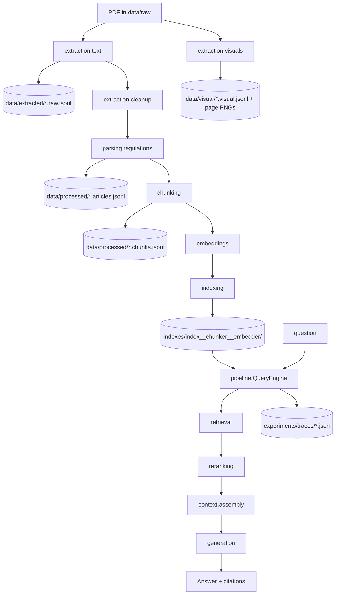

# Architecture

## Principles

1. **One module per stage.** Each pipeline stage lives in its own package with a
   typed interface (a `Protocol` or ABC), one or more implementations, and
   diagnostics.
2. **Typed contracts, not shared state.** Stages communicate only through the
   Pydantic models in [`models.py`](../src/f1_rag/models.py). A stage depends on the
   *models*, never on another stage's implementation.
3. **Selection by name.** No implementation is hard-coded into the CLI. Each stage
   owns a small `Registry`; implementations self-register with a decorator; the CLI
   resolves a name (`--retriever hybrid`) to an implementation at runtime.
4. **Inspectable artifacts.** Raw extraction, parsed chunks, indexes, traces, and
   experiment records are all written to disk.
5. **No heavy framework.** Dependency injection is a ~40-line registry
   ([`registry.py`](../src/f1_rag/registry.py)) plus a `RetrievalDeps` bundle - not
   a DI container.

## Module boundaries

| Package | Responsibility | Key interface |
| --- | --- | --- |
| `config` | settings + path resolution | `Settings` |
| `models` | shared typed models | Pydantic models |
| `registry` | name → factory DI | `Registry` |
| `extraction` | PDF → text, visuals, clean pages | functions |
| `parsing` | clean pages → `Article` records | functions |
| `chunking` | articles → `Chunk`s | `Chunker` |
| `embeddings` | text → vectors | `Embedder` |
| `indexing` | store + search vectors | `VectorStore` |
| `retrieval` | query → candidates | `Retriever` |
| `reranking` | reorder candidates | `Reranker` |
| `context` | candidates → prompt context | `ContextAssembler` |
| `generation` | context → cited answer | `Generator` |
| `tracing` | record + render a query | `TraceRecorder`, `QueryTrace` |
| `evaluation` | datasets + metrics + runs | `EvalDataset`, metrics |
| `pipeline` | compose stages (ingest/query) | `ingest`, `QueryEngine` |
| `cli` | parse flags, delegate | subcommands |

The **only** module that composes stages is
[`pipeline.py`](../src/f1_rag/pipeline.py). It contains no stage logic; it selects
implementations via registries and passes typed models between them.

## Data flow



## Index identity + idempotency

Each configuration is persisted under
`indexes/<index>__<chunker>__<embedder>/`, containing `vectors.npz` (NumPy),
`chunks.jsonl`, and a `manifest.json` with the config and a **corpus hash**. Re-running
`ingest` with an unchanged corpus is a no-op unless `--force` is given. Chunk IDs are
deterministic (`sha1(source|article|index)`), so runs are diffable.

## Query flow in one object

`QueryEngine.answer()` runs the query stages in order and records each into a
`TraceRecorder`, so the resulting `QueryTrace` is guaranteed to reflect what
actually happened: the normalized query, embedding config, every candidate with all
scores, metadata filters, selected vs discarded chunks, the exact prompt, and the
citations.

## Extending the system

Add a new implementation to any stage by writing a class/function that satisfies the
stage's `Protocol` and decorating it with that stage's registry, e.g.:

```python
@retriever_registry.register("mmr")
class MMRRetriever(Retriever):
    name = "mmr"
    def __init__(self, deps: RetrievalDeps): ...
    def retrieve(self, query, k, metadata_filter=None): ...
```

It is then immediately available as `--retriever mmr` with no CLI changes.
